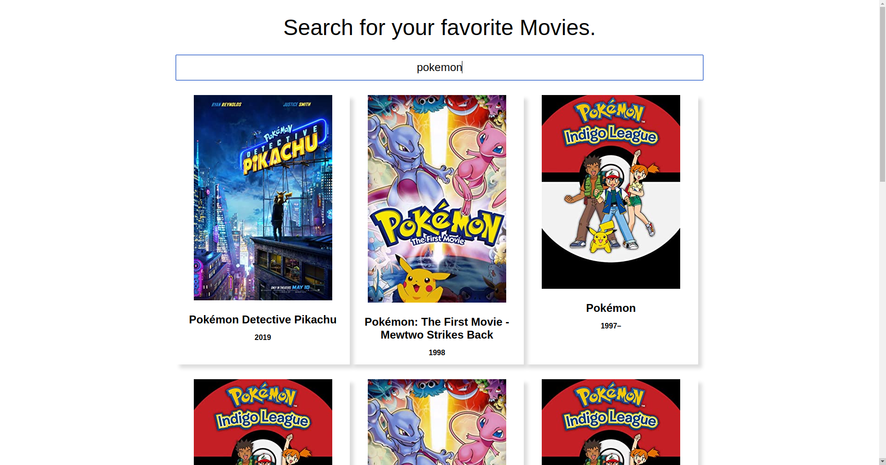

# React-Movie-Search

A simple app to show the world I can work with 3rd party APIs. I've used debouncing logic to judge when data should be fetched from the API. You can tweak those settings to your liking. Maybe add a button for search like it's 2010. It's all up to your creativity!

Wanna try it out? Get an API key from [here](http://www.omdbapi.com/) and put is as the value of the exported variable in /src/config.js. After that's done you can find instructions on running this app locally in SETUP.md.

